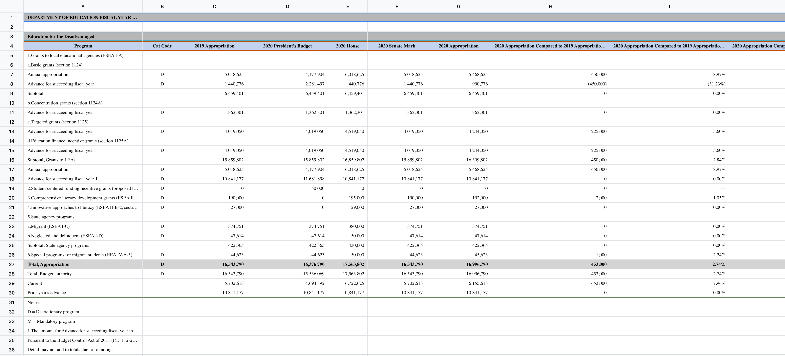
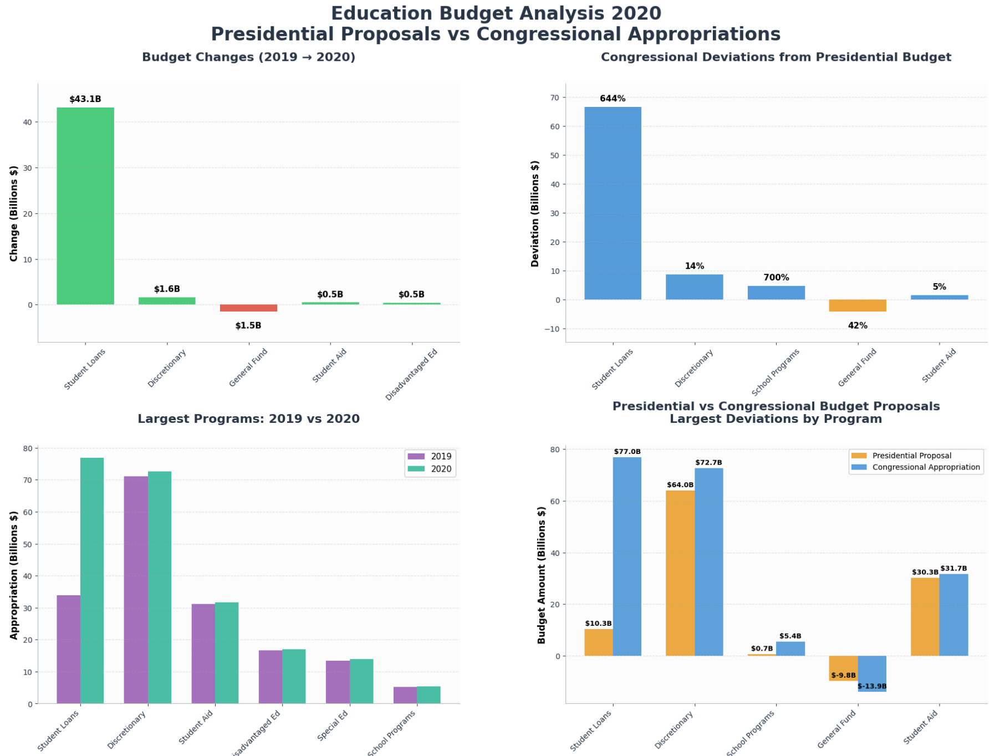

 

  

<h3 align="center">Chunkr | Open Source Document Intelligence API</h3>

  

    Production-ready API service for document layout analysis, OCR, and semantic chunking. Convert PDFs, PPTs, Word docs & images into RAG/LLM-ready chunks.
      
    <b>Layout Analysis</b> | <b>OCR + Bounding Boxes</b> | <b>Structured HTML and markdown</b> | <b>VLM Processing controls</b>
     
     
  

## Usage
1. Head to [Chunkr](https://chunkr.ai) and get your API key.
2. Replace `YOUR_API_KEY` in the notebooks.
3. Run the cells.

## Examples

This repository showcases practical examples and integrations using Chunkr. Explore real-world implementations for document processing, RAG pipelines, content extraction workflows, and advanced document analysis use cases.

### [Spreadsheets](./examples/spreadsheets/)

#### [Education Budget Analysis](./examples/spreadsheets/dashboard-demo.ipynb)

This example demonstrates how to use Chunkr's new spreadsheet parsing capabilities to extract data from an Excel file and create a dashboard to visualize the data. 

